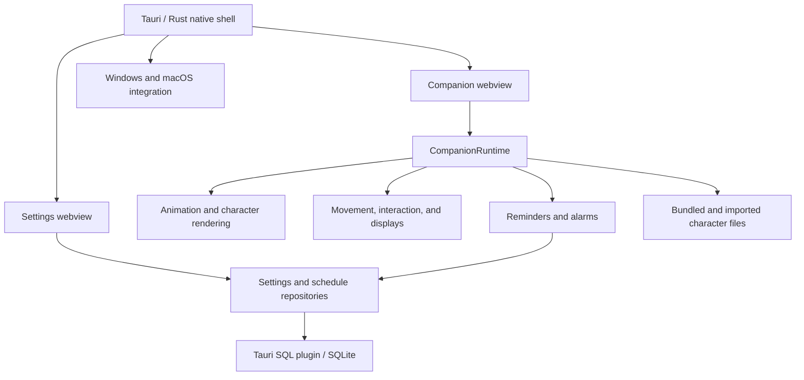

# Choto You — Project Overview

> A personal fun project: a tiny animated companion that lives on your desktop, brings familiar faces to your screen, and makes everyday reminders feel more personal.

**Creator:** Tanvir Ahmod Rafi  
**Website:** https://chotoyou.tanvirahmodrafi.com/  
**Source:** https://github.com/tanvirahmodrafi/Choto-You  
**Downloads:** https://github.com/tanvirahmodrafi/Choto-You/releases  
**App version in this checkout:** 1.1.0

## 1. What is Choto You?

Choto You is a desktop companion application for Windows and macOS. A small animated character sits above your desktop, walks around, reacts to clicks, and can be picked up and moved. When you leave your computer idle, the character can curl up and sleep.

The companion also delivers reminders and alarms through speech bubbles. Instead of a plain notification, a little character walks over to remind you to drink water, take a break, stand up, or attend something at a particular time.

Personalization is central to the idea. You can import a character that looks like yourself or someone familiar: Ma, Baba, a sibling, a partner, or another person who makes your day better. Individual reminders and alarms can use different avatars.

The repository contains two related products:

| Part | Purpose | Location |
| --- | --- | --- |
| Desktop application | Runs the companion, reminders, alarms, settings, and custom characters on the user's computer | `src/`, `src-tauri/`, `public/characters/` |
| Public website | Introduces the project, demonstrates characters, explains setup, and links to installers | `Frontend/` |

The website's interactive playground is a browser demonstration. Installing the desktop application is what allows a companion to move over other application windows.

## 2. Why does this project exist?

Choto You is a **personal fun project**, built around the enjoyment of putting a tiny, expressive character on the desktop. The idea is simple: make time spent at a computer a little more playful and familiar.

There is a practical side to that playfulness. A water reminder from a character resembling Ma or Baba can feel more personal than another generic notification. The same animation system that makes a character amusing also gives reminders a recognizable face and a little personality.

The project is also an opportunity to explore desktop engineering: transparent windows, animation timing, operating-system integration, monitor layouts, local persistence, and custom artwork. A small visual idea leads to interesting technical problems when the character has to behave consistently across real desktops.

Its guiding priorities are:

- **Fun:** walking, waving, sleeping, and reacting should make the desktop feel more alive.
- **Personal expression:** users can bring their own characters and messages.
- **Gentle usefulness:** reminders and alarms fit naturally into the companion's behavior.
- **Local ownership:** the desktop app works without accounts or a cloud service.
- **Control:** users can hide the companion, pause reminders, change its behavior, and choose where it appears.

## 3. Main features

### An animated desktop companion

The character lives in a transparent, frameless window above the desktop. The visible character responds to interaction, while the surrounding area allows clicks to reach the applications underneath.

Supported interactions include clicking, double-clicking, dragging, and right-clicking to open settings. Movement includes walking, falling after a drop, landing, and transitions between monitors. Idle detection lets the character sleep after ten minutes of cursor stillness when that behavior is enabled.

### Reminders and alarms

Reminders repeat at intervals. Built-in examples include drinking water, taking an eye break, standing up, and stretching. Users can customize messages and intervals and assign a character to deliver them.

Alarms target a time of day, with daily or one-time scheduling and an optional advance warning. They are separate from interval reminders because their timing and missed-event behavior differ. Pausing reminders does not pause clock alarms.

Announcements combine movement, animation, and a speech bubble. Avatar handovers let a different character appear for a particular reminder and then return the desktop to the usual companion.

### Custom characters

A character pack contains images and a versioned `character.json` manifest. Packs describe animation frames and character properties; they do not contain executable code.

Users can import an animated sprite sheet or provide still images for different moods. The animated import format uses an **8-column × 4-row sheet**, with rows for idle, running, waving, and individual action poses. The app processes the sheet and previews the resulting character before import is completed.

The app also provides a prompt for generating character artwork in an external image tool. The user copies the prompt, supplies their reference image to their chosen tool, and imports the resulting PNG. Choto You itself does not call an AI service or upload the photograph.

The bundled desktop character is Choto Rafi. The website also demonstrates family-themed character artwork; those website examples should not be interpreted as a separate desktop character catalog automatically installed with the app.

### Display and behavior controls

| Setting | Available behavior |
| --- | --- |
| Movement | Roam freely, appear only for reminders, or stay put |
| Monitor selection | Follow the cursor's active display, roam between displays, use the primary display, or select a specific display |
| Character appearance | Choose an avatar, adjust scale, and change movement or animation speed |
| General controls | Show or hide the companion, enable sound, and start with the computer |
| Advanced controls | Adjust the frame-rate cap, inspect the hitbox, and reset settings |

### Tray access

The app is managed through the macOS menu bar or Windows system tray. Tray actions include showing or hiding the companion, pausing reminders, opening settings, restarting, and quitting. Closing the settings window hides that window while the companion continues running.

## 4. Technology stack

The versions below describe the dependency families declared in this repository. Exact resolved versions are recorded in `package-lock.json` and `src-tauri/Cargo.lock`.

### Desktop application

| Technology | Version / family | Role |
| --- | --- | --- |
| Tauri | 2 | Desktop application shell, native windows, system tray, commands, and asset access |
| React and React DOM | 19 | Companion rendering, settings screens, and reusable UI components |
| TypeScript | 5.9 | Typed frontend code for movement, animation, scheduling, settings, and persistence |
| Vite | 7 | Development server and production bundling for the desktop webviews |
| Rust | Edition 2021; stable toolchain in CI | Native application lifecycle, OS integration, commands, and filesystem operations |
| SQLite | Through the Tauri SQL plugin | Local storage for settings, reminders, alarms, and character records |
| CSS | Native stylesheets | Transparent overlay, speech bubbles, and settings presentation |
| Tauri autostart plugin | 2 | Optional launch at login |
| Tauri log plugin | 2 | Local diagnostic logs |
| Tauri single-instance plugin | 2 | Prevents a second launch from creating another companion instance |
| Serde / serde_json | 1 | Rust data serialization and JSON handling |
| objc2 / objc2-app-kit | 0.6 / 0.3 | Direct macOS AppKit integration for window behavior |

Tauri hosts the frontend in the operating system's webview. The project combines web UI code with native Rust functionality rather than running its desktop features on a remote application server.

### Public website

| Technology | Role |
| --- | --- |
| HTML | Static page content, semantic sections, FAQs, download links, and metadata |
| CSS | Responsive layout, decorative visuals, sprite styling, and OS tray illustrations |
| Vanilla JavaScript | Sprite playback, interactive playground, character selection, dragging, mobile navigation, and release lookup |
| Google Fonts | Outfit and DM Sans typography |
| GitHub Releases API | Resolves current installers and reads public download counts |
| Vercel | Public static hosting; the site includes a Vercel redirect configuration |
| JSON-LD | Structured description of the desktop application |
| robots.txt and XML sitemap | Crawl instructions and discovery of the canonical homepage |

The website needs no framework runtime, Node dependencies, or build step. Its content and fallback download links are present in the original HTML, so they remain available without JavaScript.

### Development and delivery

| Tool | Role |
| --- | --- |
| Node.js and npm | Frontend tooling, dependency management, and asset scripts |
| Cargo | Rust dependency management, compilation, and native checks |
| Vitest | Unit and regression tests for application logic |
| TypeScript compiler | Strict static checking |
| rustfmt | Rust formatting checks |
| Clippy | Rust lint and compile checks |
| GitHub Actions | Continuous integration and installer builds |
| Tauri GitHub Action | Packages installers and attaches them to draft releases |
| Custom Node scripts | Generates character packs, tray icons, app icons, sample sheets, and documentation images |

## 5. How the application is organized

The desktop application has two HTML entry points and two native windows:

- `index.html` starts the transparent companion overlay.
- `settings.html` starts the normal settings window.

`CompanionRuntime` connects the desktop subsystems and updates them from a shared tick. It coordinates character loading, animation, movement, display selection, interaction, reminders, and settings changes.



### Important implementation details

- **Animation:** frame loading, caching, playback, and a shared ticker keep character behavior coordinated. A frame-rate cap and suspension while hidden reduce unnecessary work.
- **Movement:** movement engines and boundary checks control walking and gravity; monitor topology and coordinate conversion handle display transitions and mixed scaling.
- **Interaction:** cursor tracking and hitbox calculations determine where the character accepts clicks and drags.
- **Scheduling:** reminder and alarm repositories persist schedules, while schedulers decide when an announcement is due.
- **Persistence:** settings are stored as JSON values in a SQLite key/value table. Separate tables hold reminder, alarm, and character data.
- **Native integration:** Rust handles platform-specific window behavior, the tray, startup, logging, and avatar commands. macOS uses AppKit integration to support overlay behavior across fullscreen Spaces.
- **Window synchronization:** both webviews use shared persisted data and change notifications to keep settings and schedules in step.

## 6. Repository map

```text
Choto-You/
├── Frontend/                 Public landing page; deployed separately
│   ├── index.html           Page content, SEO metadata, and JSON-LD
│   ├── styles.css           Website layout and illustrations
│   ├── app.js               Demo interactions and release lookup
│   ├── assets/              Website sprites and brand images
│   ├── robots.txt           Crawl rules and sitemap reference
│   ├── sitemap.xml          Canonical homepage entry
│   └── vercel.json          Hosting redirect configuration
├── src/
│   ├── app/                 Desktop entry points and styles
│   ├── companion/           Runtime, rendering, and overlay layout
│   ├── animation/           Ticker, frame loading, and playback
│   ├── movement/            Walking, gravity, and monitor transitions
│   ├── displays/            Display discovery, topology, and tracking
│   ├── interaction/         Cursor, hitbox, click, and drag handling
│   ├── behavior/            Wandering, idle detection, and event queue
│   ├── reminders/           Reminder scheduling and announcement behavior
│   ├── alarms/              Time-of-day scheduling
│   ├── characters/          Pack validation, imports, and sprite processing
│   ├── database/            Persistence and repositories
│   └── settings/            Settings UI, state, and configuration
├── src-tauri/
│   ├── src/                 Native Rust application
│   │   ├── platform/        macOS and Windows behavior
│   │   ├── commands/        Native commands, including avatar operations
│   │   ├── windows/         Window management
│   │   └── tray/            Tray icon and actions
│   ├── migrations/          SQLite schema migrations
│   ├── icons/               Desktop application icons
│   └── tauri.conf.json      Application, window, and security configuration
├── public/characters/       Bundled desktop character packs
├── tools/                   Asset generation scripts
├── docs/                    Design documentation and images
└── .github/workflows/       CI and release automation
```

## 7. Privacy and network behavior

The desktop application's core features are local. It has no account system, cloud database, telemetry, or automatic update check. Settings, reminders, alarms, custom avatar files, and saved position stay on the user's machine.

| Platform | Application data directory |
| --- | --- |
| macOS | `~/Library/Application Support/com.chotoyou.app/` |
| Windows | `%APPDATA%\com.chotoyou.app\` |

The desktop security configuration restricts imported asset access to the application's avatar directory. Its content security policy limits the origins from which the webviews can load resources.

The public website has separate network behavior: it loads Google Fonts and requests public GitHub release information. It has no website backend, cookies, or analytics implemented in its source. If the GitHub API is unavailable, download links still lead to the official releases page.

Using an external AI tool to create artwork is an optional manual workflow. Any upload to that tool is performed by the user, outside the desktop application.

## 8. Running and building the project

Desktop development needs Node.js compatible with the declared tooling, npm, a stable Rust toolchain, and the native build prerequisites for the chosen operating system. The repository CI uses Node 20. Windows builds require the MSVC build tools and WebView2; macOS builds require Xcode command line tools.

From the repository root:

```bash
npm install
npm run tauri:dev
```

Useful commands:

| Command | Purpose |
| --- | --- |
| `npm run dev` | Start the desktop frontend's Vite server |
| `npm run tauri:dev` | Launch the full desktop application in development |
| `npm run typecheck` | Check TypeScript without emitting files |
| `npm test` | Run the Vitest suite once |
| `npm run test:watch` | Run tests in watch mode |
| `npm run build` | Type-check and bundle the desktop frontend |
| `npm run tauri:build` | Build an installable desktop bundle |
| `cargo fmt --check --manifest-path src-tauri/Cargo.toml` | Check Rust formatting |
| `cargo clippy --manifest-path src-tauri/Cargo.toml --all-targets -- -D warnings` | Run native lint and compile checks on a supported build environment |

To preview the public website independently:

```bash
cd Frontend
python3 -m http.server 8000
```

Then visit `http://localhost:8000`. The repository-root `npm run build` builds the desktop webviews; publishing the landing page means serving the contents of `Frontend/`.

## 9. Testing and releases

Vitest tests live beside implementation files as `*.test.ts`. Coverage includes scheduling, movement, animation timing, monitor topology, interaction, settings merging, character validation, and sprite import behavior. Tests use controlled inputs for time and display behavior where appropriate.

CI checks TypeScript, runs the tests, checks Rust formatting, and builds/lints the native crate on macOS and Windows. This helps catch platform-specific compilation issues even when development is happening on one operating system.

The release workflow runs on version tags or a manual trigger. It builds:

- A universal macOS `.dmg` for Intel and Apple Silicon.
- Windows x64 `.exe` and `.msi` installers.

Installers are attached to a **draft GitHub release** for review before publication. Code signing is not configured in the checked-in workflow, so operating systems can show installer or first-launch warnings.

## 10. Current scope and limitations

- Desktop targets are Windows and macOS. Linux and mobile are not implemented release targets.
- Multi-monitor logic has automated coverage, but the repository documents limited physical multi-monitor testing.
- Windows compilation is covered by CI; hands-on behavior testing has been more limited than on macOS.
- Installers are unsigned, and updates are installed manually.
- Character quality depends on the imported artwork. Incorrect sheet layouts or clipped poses can require a better source image.
- Website deployment and desktop releases are separate processes. Updating a landing-page file does not rebuild or release the desktop application.

## 11. Short description for sharing

**Choto You is a personal fun project that puts a tiny animated companion on your Windows or macOS desktop. It walks, waves, sleeps, and delivers reminders through familiar characters you can customize. Built with Tauri, React, TypeScript, Rust, and SQLite, the desktop app keeps its data local and works offline. A separate HTML, CSS, and JavaScript website introduces the project and lets visitors try the characters before downloading.**

## Further reading

- [README](README.md): installation, usage, troubleshooting, and development commands.
- [Design notes](docs/DESIGN.md): deeper explanations of architecture and platform decisions.
- [Website documentation](Frontend/README.md): static hosting, website behavior, and SEO configuration.
- [Repository guidelines](AGENTS.md): project conventions and contribution checks.
