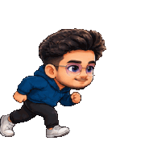
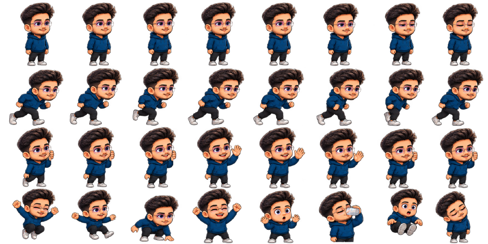

<div align="center">


# Choto You

**A tiny animated companion who lives on your desktop — walks around your
screens, naps when you leave, and taps you on the shoulder when it is time to
drink water.**

[](#download)
[](https://v2.tauri.app/)
[](https://react.dev/)
[](https://www.rust-lang.org/)
[](#your-data-never-leaves-your-machine)


[**Download**](#download) · [**Using it**](#using-it) · [**Make it look like you**](#make-it-look-like-you) · [**Build from source**](#build-from-source) · [**Design notes**](docs/DESIGN.md)

</div>

---

## What this is

Choto You is a desktop pet, in the spirit of the little characters that used to
wander across screens in the nineties — but built for a 2025 desktop with
multiple monitors, mixed DPI, fullscreen Spaces and a tray icon.

The companion sits on top of your desktop in a transparent, frameless window.
It walks along the bottom of the screen, hops between monitors, reacts when you
click it, and can be picked up and dropped anywhere (it falls to the floor when
you let go). Leave the machine alone for ten minutes and it curls up and sleeps.

It is also useful, which is the part that makes it stay installed: it carries
your **reminders** (drink water, look away from the screen, stand up) and your
**alarms** (standup at 09:45, tablets at ten), and walks over to tell you about
them in a speech bubble instead of firing a notification you will dismiss
without reading.

<div align="center">





<sub>Standing · running · leaning in to say hello — the three looping animations every character pack has.</sub>

</div>

## Highlights

| | |
| --- | --- |
| 🚶 **Lives on the desktop** | A transparent, shadowless overlay that stays above your windows without stealing clicks. Only the character itself is solid; everywhere else, clicks pass straight through. |
| 🖥️ **Multi-monitor native** | Follows the cursor between displays, roams across them, or stays on one. Walks to the edge, looks down, jumps and lands on the next screen. Handles negative origins and mixed DPI. |
| 💧 **Reminders that have a face** | Interval reminders for water, eye breaks, posture, stretching — plus your own, with your own wording and interval. |
| ⏰ **Clock alarms with a warning** | "Standup at 09:45", with an optional nudge five minutes before, which is the part you can actually act on. |
| 🎭 **Bring your own character** | Import a sprite sheet or a folder of stills. There is even a generated prompt for turning a photograph of someone into an animated avatar. |
| 👥 **A household of avatars** | A reminder can bring its own character: one person nags you about water, another reminds you to pray. They hand the desk over on foot, not with a cut. |
| 😴 **Quiet when you are away** | Sleeps after ten minutes of stillness, caps its frame rate, and suspends animation entirely while hidden. |
| 🔒 **Entirely offline** | No account, no backend, no telemetry, no update check. Nothing it knows about you leaves the machine. |

---

## Download

Installers for every release are on the releases page:

### 👉 **[github.com/tanvirahmodrafi/Choto-You/releases](https://github.com/tanvirahmodrafi/Choto-You/releases)**

| Platform | File | Notes |
| --- | --- | --- |
| **macOS** (Intel + Apple Silicon) | `Choto You_<version>_universal.dmg` | One disk image for both architectures |
| **Windows 10/11** (x64) | `Choto You_<version>_x64-setup.exe` | The recommended installer |
| **Windows 10/11** (x64) | `Choto You_<version>_x64_en-US.msi` | For deployment through group policy or an MDM |

There is no Linux build. The overlay depends on per-platform window code that
exists for macOS and Windows only.

### Installing on macOS

1. Open the `.dmg` and drag **Choto You** into **Applications**.
2. The builds are **not code-signed**, so the first launch is blocked by
   Gatekeeper. **Right-click** the app in Applications → **Open** → confirm at
   the prompt. Double-clicking it the usual way only offers to move it to the
   Bin.
3. After that one approval it launches normally for good.

> **Where did it go?** Choto You has **no Dock icon** — deliberately, because
> that is what lets the overlay follow you into other apps' fullscreen Spaces.
> Look for the small silhouette in the **menu bar**, or just right-click the
> character itself.

### Installing on Windows

1. Run `Choto You_<version>_x64-setup.exe`.
2. SmartScreen will warn about an unknown publisher, because the installer is
   unsigned: **More info** → **Run anyway**.
3. The app appears in the notification area — click the overflow arrow if
   Windows has tucked it away.

### Updating and uninstalling

There is no auto-updater, on purpose: an app that makes no network calls at all
is worth more than the convenience of a self-update. Install a new version over
the old one — your settings, reminders and avatars are kept.

To remove it: turn off **Start with computer** in Settings → General, quit from
the tray, then drag the app to the Bin (macOS) or uninstall it from
Settings → Apps (Windows). Your data directory is left behind; delete it too if
you want a clean slate — see [Your data](#your-data-never-leaves-your-machine).

---

## Using it

**First launch.** The companion appears on your primary display and starts
wandering. There is nothing to sign in to and no onboarding — the defaults are
meant to be usable as they are.

### Interacting with it

| Do this | And it does this |
| --- | --- |
| **Click** | Reacts — a small cheer |
| **Double-click** | A bigger reaction |
| **Drag** | Picks it up; it falls to the floor when you let go |
| **Right-click** | Opens the settings window |
| **Click anywhere else** | Nothing — the click reaches the app underneath, as if the overlay were not there |

### The tray icon

| Item | What it does |
| --- | --- |
| **Show companion** | Shows or hides the overlay, suspending the animation loop while hidden |
| **Pause reminders** | Stops reminders firing. Resuming pushes every schedule forward by the length of the pause, so you do not get an hour of backlog at once |
| **Settings…** | Opens the settings window |
| **Restart companion** | Restarts the app |
| **Quit** | Exits |

Closing the settings window **hides** it rather than quitting. The application
lives in the tray.

### Settings

Seven tabs. Every change applies immediately — both windows read the same
database and are kept in step, so nothing needs a restart.

| Tab | What you set there |
| --- | --- |
| **General** | Start with computer, launch minimized, sound, show companion |
| **Character** | Which avatar, its size, animation speed, and importing your own |
| **Display** | Which monitor it lives on |
| **Reminders** | Interval reminders — water, posture, breaks, and any you add |
| **Alarms** | Clock alarms with an optional warning beforehand |
| **Behavior** | Roam freely, only when reminding you, or stay put |
| **Advanced** | Debug hitbox overlay, frame-rate cap, reset everything |

### How much it moves

Settings → **Behavior**:

| Mode | What it does |
| --- | --- |
| **Roam freely** | Wanders the screen on its own |
| **Only when reminding me** | Stays out of sight. Peeks around a side edge, steps into the corner to deliver its message, then runs off again |
| **Stay put** | Never moves by itself. You can still drag it anywhere |

### Which screen it lives on

Settings → **Display**:

| Mode | What it does |
| --- | --- |
| **Follow me** | Moves to whichever display the cursor has been on for a few seconds |
| **Roam** | Wanders between displays on its own |
| **Primary** | Stays on the primary display |
| **Specific** | Stays on a chosen display, falling back to the primary one if it is unplugged |

Following is deliberately unhurried. Chasing the pointer the instant it crosses
a boundary would make the companion teleport all day, which is the opposite of
restful.

---

## Reminders and alarms

Two different things that arrive the same way — the companion walks over and
says it out loud in a speech bubble.

```
Reminders — every so often            Alarms — at a time
  every 45 min  → "Drink some water!"   07:55 → "Standup in 5 minutes."
  every 20 min  → "Look away a bit."    08:00 → "Bring the slides."
```

**Reminders** repeat on an interval. Four are built in — water, a 20-minute eye
break, stand up, stretch — and you can add your own with your own message and
interval. Pause them from the tray when you are in a meeting; resuming spreads
the backlog out instead of dumping it on you.

**Alarms** happen at a wall-clock time, daily or once. Each can carry a
**warning** a few minutes beforehand, which is the part that earns the feature:
being told at 08:00 that the meeting is at 08:00 is too late to be useful.

Alarms deliberately **ignore the reminder pause** — an alarm is a moment you
asked for — and a badly late one (more than five minutes, because the machine
was asleep) is **skipped rather than announced**, with a line in the log, so it
does not go off an hour after it mattered.

Each reminder and each alarm can name **its own avatar**, who walks on, says the
line, and gives the desk back to whoever was there before.

---

## Make it look like you

One avatar ships with the app — **Choto Rafi** — and you can add more. A
character pack is a `character.json` manifest plus images. **No executable
code**, ever; the manifest is versioned and fully validated on load.

<div align="center">


<sub>Eight frames of a run cycle, aligned on a shared baseline so the character does not swell and slide as it moves.</sub>
</div>

### From a photo of someone

**Settings → Character → *Make one from a photo*** is the route to an avatar
that actually moves.

The app makes no network calls, so it does not talk to an image model itself —
**you are the transport**:

1. **Copy the prompt** the app generates. Add a name and a note if you like
   ("wearing a white saree").
2. **Paste it into ChatGPT or Claude** along with a clear photo of the person.
3. **Bring the returned PNG back** and choose it. The app slices it, keys out
   the background, and shows you every pose on a checkerboard before you commit.

What comes back is an 8×4 sprite sheet — 32 poses in one image. Three rows are
real animations (idle with a blink, a full run cycle, a peek-and-wave) and the
fourth row is eight single poses (jump, fall, land, happy, surprised, drinking,
being held, asleep).

<div align="center">


<sub>The sheet the bundled avatar was built from — exactly the layout the generated prompt asks for, and exactly the layout the importer slices.</sub>
</div>

Want to try the import without a round trip to a model? `npm run assets:sample-sheet`
writes a sheet in precisely this layout to `samples/`.

### From still pictures

**Settings → Character → *Add still pictures*** imports one image per mood.
Simpler, but a still cannot walk — it slides. Only **Normal** is required;
every other pose falls back along a chain that ends there, so a single drawing
is already a working avatar, and it can gain real animations one slot at a time.

Imported packs are written to `avatars/<id>/` in the app data directory and
served through Tauri's asset protocol, scoped to that one folder.

---

## Your data never leaves your machine

No backend. No cloud. No telemetry. No update check. No network access in any
core feature. Everything — settings, reminders, alarms, your avatars, the saved
position — is one SQLite file plus a folder of images on your own disk:

| Platform | Directory |
| --- | --- |
| **macOS** | `~/Library/Application Support/com.chotoyou.app/` |
| **Windows** | `%APPDATA%\com.chotoyou.app\` |

Copy that directory to back everything up; delete it to reset the app to a
first launch.

Logs — plain text, tagged by subsystem — are at
`~/Library/Logs/com.chotoyou.app/` on macOS and
`%LOCALAPPDATA%\com.chotoyou.app\logs\` on Windows.

---

## Troubleshooting

<details>
<summary><b>Nothing appeared after launching</b></summary>

Check whether the companion is hidden: tray icon → **Show companion**.

Display enumeration can legitimately return nothing during wake or at login, so
startup waits up to a minute for a display and retries the whole sequence three
times. If it is still blank, the log file names the step that gave up.
</details>

<details>
<summary><b>macOS says the app is damaged or cannot be opened</b></summary>

That is Gatekeeper on an unsigned build, not a corrupt download. **Right-click**
the app in Applications and choose **Open**.
</details>

<details>
<summary><b>The character froze in place</b></summary>

It stalls if the overlay is left on a Space you are not looking at, because
WebKit throttles timers in a hidden webview. The current window policy prevents
this, and the app logs a warning when its loop stalls — please open an issue
with the surrounding log lines.
</details>

<details>
<summary><b>Clicks are not reaching the app underneath</b></summary>

The overlay only intercepts clicks inside the character's declared hitbox.
Settings → Advanced → **Debug mode** draws it, which usually reveals a pack
declaring a hitbox far larger than its drawing.
</details>

<details>
<summary><b>A setting made it unusable</b></summary>

Settings → Advanced → **Reset…** puts everything back to its default. Values
read from the database are clamped on load, so one bad value costs its own
default rather than preventing startup.
</details>

---

## Build from source

### Prerequisites

| Requirement | Version | Check |
| --- | --- | --- |
| Node | 20 or newer | `node --version` |
| Rust | stable, via `rustup` | `rustup toolchain install stable` |
| macOS | Xcode command line tools | `xcode-select --install` |
| Windows | MSVC build tools + WebView2 | WebView2 ships with Windows 11 and current Windows 10 |

Tauri's [prerequisites page](https://v2.tauri.app/start/prerequisites/) lists
the system packages per platform if the build fails to configure.

### Run it

```bash
git clone https://github.com/tanvirahmodrafi/Choto-You.git
cd Choto-You
npm install
npm run tauri:dev
```

Frontend edits hot-reload. Rust changes trigger a rebuild and restart — the
first one takes a while, since the whole dependency tree compiles.

If `cargo` and `tauri` are not on your `PATH`, prefix commands with
`PATH="$HOME/.cargo/bin:$PATH"`.

### Package it

```bash
npm run tauri:build
```

Installers land in `src-tauri/target/release/bundle/`. For a universal macOS
binary, install both targets first:

```bash
rustup target add aarch64-apple-darwin x86_64-apple-darwin
npm run tauri -- build --target universal-apple-darwin
```

Cross-compiling between macOS and Windows is not supported; each platform's
installers are built on that platform, which is what the release workflow does.

### Checks

```bash
npm test          # Vitest, once
npm run typecheck # tsc --noEmit, strict
cargo fmt --check --manifest-path src-tauri/Cargo.toml
```

CI runs all three on every push, and additionally compiles the Rust crate on
both macOS and Windows with `clippy -D warnings`.

### All the scripts

| Script | What it does |
| --- | --- |
| `npm run tauri:dev` | The app, with the Vite dev server |
| `npm run tauri:build` | The installable bundle |
| `npm test` / `npm run test:watch` | Unit tests |
| `npm run typecheck` | Strict TypeScript check, no emit |
| `npm run build` | Typecheck plus the frontend bundle |
| `npm run assets:character` | Rebuilds the bundled avatar from `art/avatar-sheet.png` |
| `npm run assets:icon` | Rebuilds the app icon set from `art/app-icon.png` |
| `npm run assets:tray` | Rebuilds the menu bar silhouette |
| `npm run assets:sample-sheet` | Writes a sample sprite sheet for testing import |
| `npm run assets:readme` | Rebuilds the figures in this file from the bundled avatar |

---

## How it is put together

**Tauri 2** (Rust) hosting **two** separate webviews: a transparent overlay and
an ordinary settings window. **React 19 + TypeScript** on the frontend,
**SQLite** for persistence, **Vitest** for tests.

```
src/
  companion/   CompanionRuntime — the hub that drives everything from one tick
  animation/   ticker, player, frame cache
  movement/    walking, gravity, boundaries, monitor transitions
  displays/    enumeration, topology, active-monitor detection, hot-plug
  behavior/    wandering, idle detection, the priority event queue
  interaction/ cursor tracking, hitbox, click/drag handling
  reminders/   scheduling, performance, the avatar handover
  alarms/      clock alarms
  characters/  pack loading, validation, sprite-sheet slicing
  database/    the only place SQL lives
  settings/    the settings window
src-tauri/src/
  commands/    the frontend-facing command surface
  windows/     window creation and runtime configuration
  platform/    every line of macOS/Windows divergence
```

**[`docs/DESIGN.md`](docs/DESIGN.md)** is the long-form version: why the window
policy is what it is (with the measurements), how coordinates work across
mixed-DPI monitors, how the sprite-sheet slicer finds row boundaries per column
so one overflowing drawing does not cost a whole row its shoes, and what is
still imperfect. Worth reading before changing any of it.

Contributor conventions — style, naming, commit and PR expectations — are in
[`AGENTS.md`](AGENTS.md). [`CLAUDE.md`](CLAUDE.md) holds the invariants that are
easy to break by accident.

---

## Status

Everything described above is implemented and working. The honest caveats:

- **Multi-monitor behaviour is covered by tests, not by hardware.** Development
  happened on a single display; the synthetic layouts include negative origins
  and mixed DPI, but they have not been exercised against two real monitors.
- **Windows is built and type-checked in CI on every push**, but is far less
  exercised by hand than macOS. Releases are left as drafts until the Windows
  installer has been smoke-tested.
- **Builds are unsigned.** Signing needs a paid Apple Developer account and a
  Windows code-signing certificate; neither is set up, which is why the first
  launch needs a click-through on both platforms.

Bug reports with log lines are genuinely useful — particularly from anyone with
more than one monitor.

---

<div align="center">


**Choto You** — built with Tauri, React and Rust. Original artwork throughout.

</div>
